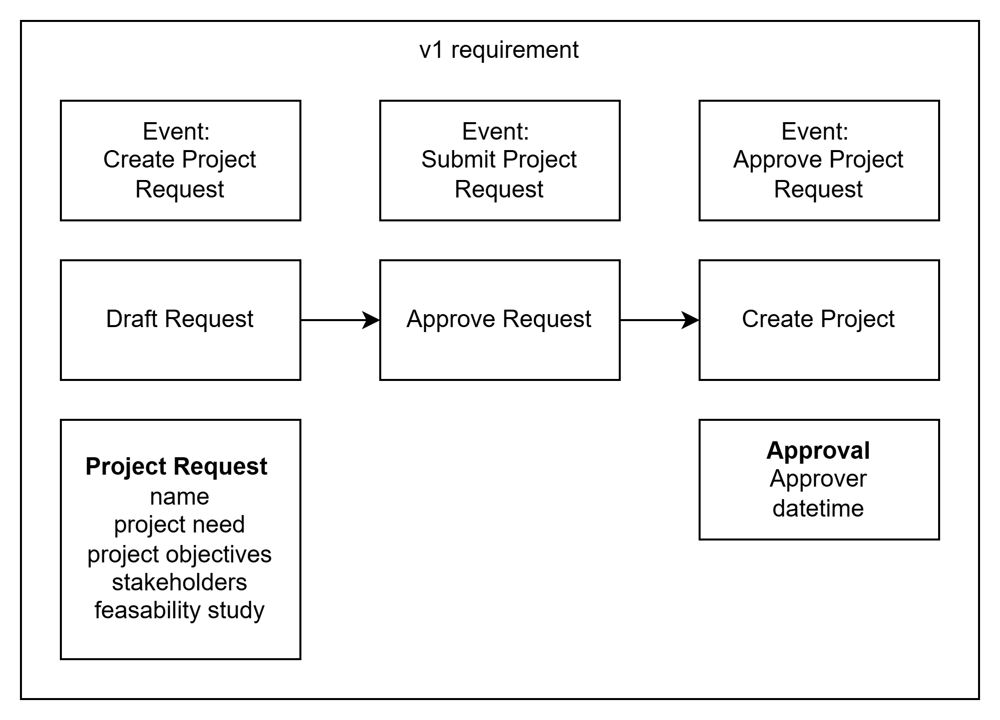

# Project Request System - Architecture Document

```perplexity
using the attached template and provided images can you prepare an architecture document ?
```




## 1. Executive Summary

The Project Request System is designed to manage the lifecycle of project requests from creation through approval to project instantiation. The system implements a three-stage workflow with robust security and scalability features.

Key architectural decisions:
- Layered architecture approach with clear separation of concerns
- Event-driven architecture for workflow management
- Microservices-based implementation for scalability
- Infrastructure as code for consistent deployment

## 2. System Context

### Business Context
The system manages project requests through three main states:
- Draft Request
- Approve Request
- Create Project

### Technical Context
Built using a modern tech stack with:
- Frontend: Web-based UI components
- Backend: Microservices architecture
- Workflow: Event-driven state management
- Storage: Distributed database system

### External Dependencies
- Authentication service
- Business rules engine
- Workflow engine
- Monitoring and logging infrastructure

## 3. Architectural Overview

### UI Layer
Four main components:
- Project Request Report: Detailed view of project requests
- Submitted Project Request List: Overview of submitted requests
- Project Request List: Management of all requests
- Project Request Wizard: Step-by-step request creation interface

### Orchestration Layer
- API Gateway: Central entry point for all client requests
- Event Handler: Manages asynchronous event processing
- Submit Project Request Creation flow: Orchestrates the request lifecycle

### Engine Layer
- ProjectRequest Service: Core business logic implementation
- Workflow Engine Integration: Manages state transitions
- Business Rule Engine: Enforces business constraints

### Repository Layer
- ProjectRequest Repository: Persistent storage for request data
- Rule Repository: Storage for business rules and validation logic

## 4. Infrastructure Components

- Logging Service: Centralized logging solution
- Monitoring System: Real-time system monitoring
- Authentication Service: User identity management
- Permissions Management: Access control and authorization

## 5. Cross-Cutting Concerns

### Security
- Role-based access control
- Secure API gateway
- Audit logging
- Data encryption

### Performance
- Asynchronous processing
- Caching strategy
- Database optimization

### Scalability
- Horizontal scaling capability
- Microservices architecture
- Event-driven design

## 6. Data Architecture

### Data Models
- Project Request:
  - name
  - project need
  - project objectives
  - stakeholders
  - feasibility study

- Approval:
  - approver
  - datetime

### Data Flow
1. UI Layer → API Gateway
2. API Gateway → ProjectRequest Service
3. ProjectRequest Service → Repository Layer
4. Event notifications through Event Handler

## 7. Integration Architecture

### API Specifications
- RESTful APIs for synchronous operations
- Event-based messaging for asynchronous operations

### Event Schema
Three main events:
- Create Project Request
- Submit Project Request
- Approve Project Request

## 8. Deployment Architecture

### Environment Specifications
- Development environment
- Staging environment
- Production environment

### Infrastructure Requirements
- Container orchestration platform
- Message broker system
- Distributed database system
- Monitoring and logging infrastructure

## 9. Security Architecture

- Authentication through centralized auth service
- Authorization using RBAC
- API security through gateway
- Data encryption at rest and in transit

## 10. Operational Architecture

### Monitoring Strategy
- Real-time system monitoring
- Performance metrics collection
- Business metrics tracking
- Error tracking and alerting

### Logging Framework
- Centralized logging
- Log aggregation
- Audit logging
- Error logging

## 11. Quality Attributes

- High availability design
- Scalable architecture
- Secure by design
- Maintainable codebase

## 12. Risks and Mitigations

### Technical Risks
- Data consistency in distributed system
- Performance under load
- Integration complexity

### Mitigations
- Event sourcing pattern
- Scalable architecture
- Comprehensive testing strategy

## 13. Future Considerations

- Enhanced workflow capabilities
- Advanced reporting features
- Integration with additional systems
- Performance optimizations

## Appendices

### Technical Stack
- Frontend: Modern web framework
- Backend: Microservices architecture
- Database: Distributed database system
- Infrastructure: Cloud-native deployment

### Infrastructure Diagrams
- System architecture diagram
- Data flow diagram
- Network architecture diagram
- Deployment diagram

This architecture document provides a comprehensive blueprint for implementing the Project Request System while ensuring scalability, security, and maintainability.

