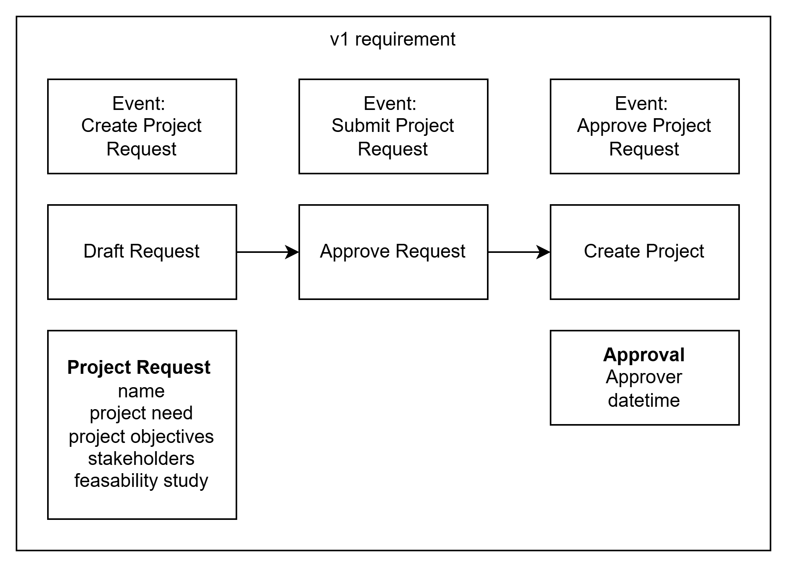

# Project Requirements

```
can you create requirement page from the attached image ?
```



## Project Request Requirements

**Events**
- Create Project Request
- Submit Project Request 
- Approve Project Request

**Workflow States**
1. Draft Request
2. Approve Request  
3. Create Project

**Data Models**

Project Request:
- name
- project need
- project objectives
- stakeholders
- feasibility study

Approval:
- approver
- datetime

**Business Rules**
- Project requests must follow the sequential flow: Draft → Approve → Create
- Each project request requires approval before project creation
- Approval must include both approver information and timestamp
- All project request fields are mandatory for submission

**Data Requirements**
- Project name must be unique and identifiable
- Project need must clearly state business justification
- Project objectives must be measurable and specific
- Stakeholders list must identify all impacted parties
- Feasibility study must assess project viability

**Process Flow**
1. User creates draft project request with required information
2. User submits completed project request for approval
3. Approver reviews and approves/rejects request
4. Upon approval, system creates the formal project

This specification represents version 1 (v1) of the project request requirements.
